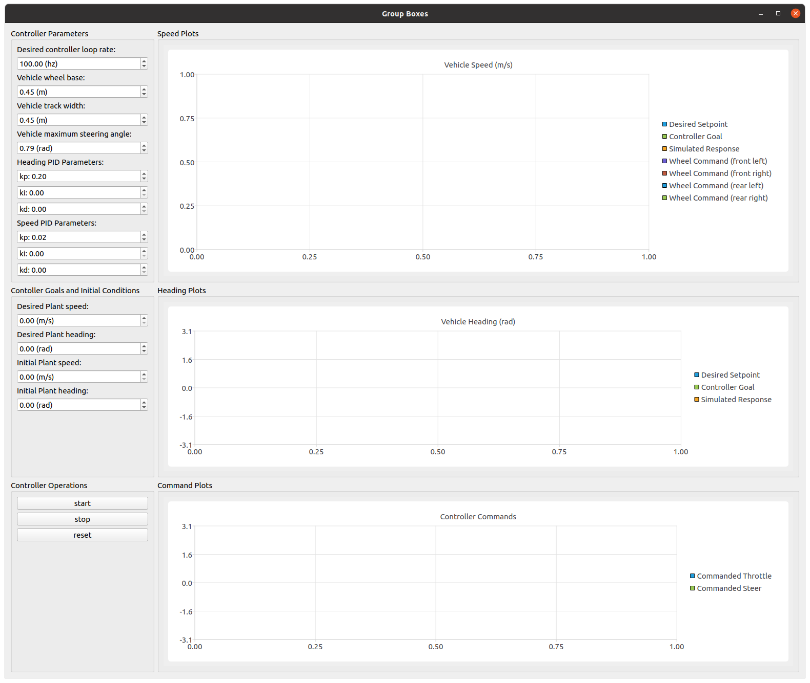
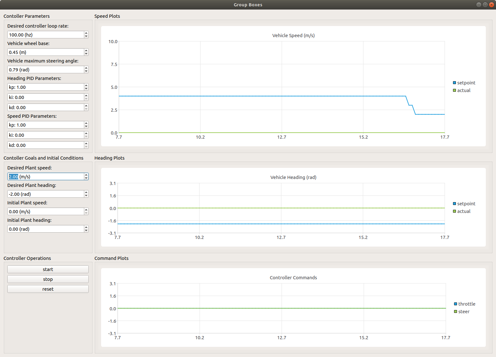
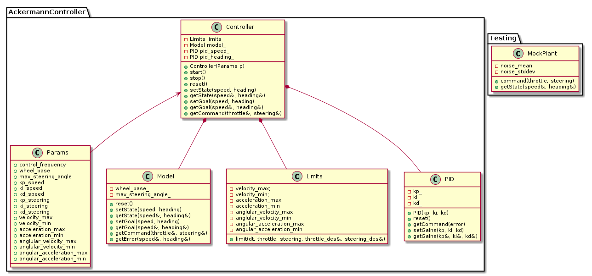
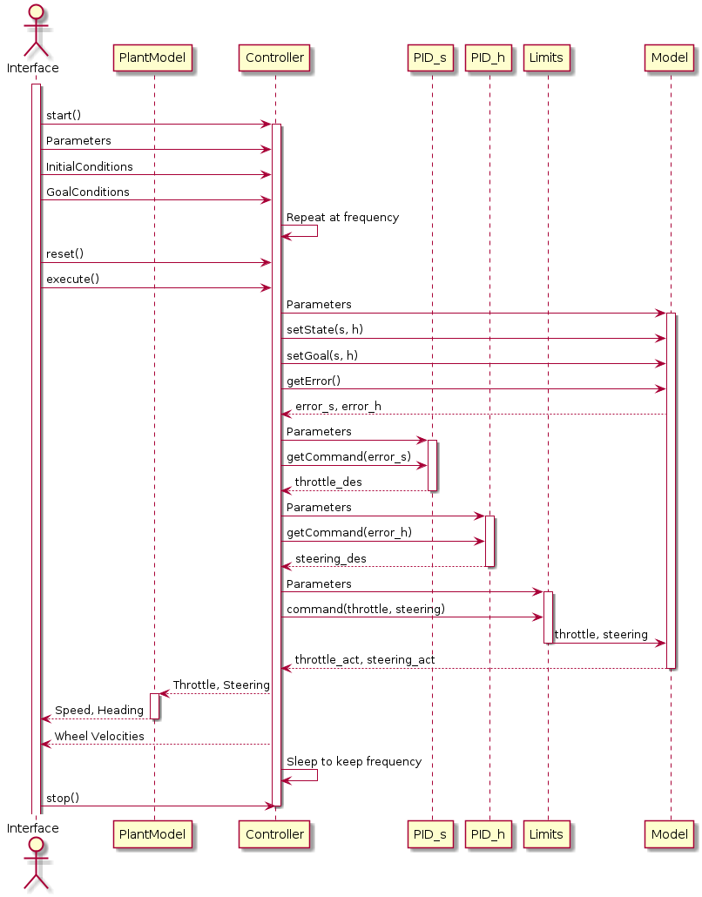

# Ackermann Controller
[](https://travis-ci.org/danielmohansahu/ackermann-controller)
[](https://coveralls.io/github/danielmohansahu/ackermann-controller?branch=master)
[](https://opensource.org/licenses/MIT)
---

## Overview

This is an implementation of an [Ackermann Steering Geometry](https://en.wikipedia.org/wiki/Ackermann_steering_geometry) controller. The user is able to input a desired heading and speed in the global reference frame which the controller will drive the robot model towards, based upon rover parameters and limitations.

To calculate the Ackermann steering angles for a four wheeled vehicles, a simplified model with a single front and rear wheel is assumed. The steering angle of this simulated single steering wheel is used to calculate the updated heading of the rover along with the vehicle wheel base. For an Ackermann steering system, the two actual steering wheels are perpindicular to the radius of the turning circle traced by each wheel; the difference in angles for each of these wheels can be calculated based on the track of the rover. The different turning circles and the vehicle speed are used to calculate individual wheel speeds.
  
## Dependencies

This project requires a C++11 enabled compiler and `cmake`. In addition, we use QT5 for visualization of our demo.

QT5 (and QtCharts) can be installed via the following command on Ubuntu 18.04:

```bash
sudo apt-get install qt5-default libqt5charts5-dev
```

## Usage Documentation
### Build Instructions

To build the package on Ubuntu 18.04, run the following from a terminal.

```bash
git clone https://github.com/danielmohansahu/ackermann-controller
cd ackermann-controller
mkdir build && cd build
cmake .. && make
```
A script to launch this is included in BashScripts.

### Demonstration Instructions

Assuming the build succeeded, you can then run the demo code.

```bash
# from your build directory (e.g. ackermann-controller/build/)
./app/demo
```

A script to launch this is included in BashScripts.

You should see something similar to the following, which allows you to evaluate the system and play with parameters against a mock Plant.

Empty | Running
 --- | ---
  | 

### Testing Instructions

Unit and System tests are run during Continuous integration, but you can run them manually from the command line as well:

```bash
# from your build directory (e.g. ackermann-controller/build/)
./test/cpp-test
```
A script to launch this is included in BashScripts.

To generate CPPCheck and CPPLint code analysis:

```bash
# from the BashScripts directory
chmod +x BashScripts/check_cppcheck.sh BashScripts/check_cpplint.sh
./BashScripts/check_cppcheck.sh
./BashScripts/check_cpplint.sh
```

## Personnel
* Spencer Elyard, *TODO: Complete personnel blurb.*
* Santosh Kesani, *TODO: Complete personnel blurb.*
* Daniel Sahu, a roboticist working on his Masters at UMD.

## Licensing

This project uses the MIT License as described in [the license file](LICENSE).

## Engineering Processes and Documentation

Details on the status of our Agile Iterative Process (AIP) [can be found here](https://docs.google.com/spreadsheets/d/1nx85sowA3IRX-usU_M1hhwHplOLXMWdkvec2w3Roi5Q/edit?usp=sharing)

Sprint planning notes and reviews [can be found here](https://docs.google.com/document/d/1MEoRXtJXdUWnkTbJmcDfJYct3i6_LEJ-TULpP2h_qYA/edit?usp=sharing).

## Known Bugs and Issues
**TODO: Annote bugs and issues when uncovered.**

### Documentation Generation instructions
To generate Doxygen documentation:

```bash
# from your install directory (e.g. ackermann-controller/)
doxygen Doxyfile
```

To access Doxygen documentation, navigate to:
```
doxygen/html/index.html
```

### Parameters and Limitations

#### Rover Model
The controller enforces the various limitations of the rover:

* Physical Parameters
  * Robot wheel base (length between front and rear wheels). (0.45 meters for demo)
  * Maximum allowable steering angle (absolute value) (0.785 radians for demo)
* Dynamic Limitations
  * Maximum (forward) and minimum (reverse) speed limitations (10 m/s and 0 m/s for demo).
  * Maximum (forward) and minimum (reverse) acceleration limitations (+/- 5 m/s^2 for demo).
  * Maximum (right) and minimum (left) angular velocity limitations (TBD)
  * Maximum (right) and minimum (left) angular acecleration limitations (TBD)
* Controller Parameters
  * Frequency (100hz for demo)
  * PID controller parameters for speed control
  * PID controller parameters for heading control
  
#### Controller Model
The controller will accept the following inputs:

* Desired heading (global coordinate frame) and speed
* Updates to current speed and heading from rover model

The controller will provide the following outputs:

* Throttle and Steering Commands, limited as appropriate by the established limitations from the rover model
* Current calculated speed and heading
* Current desired heading (global coordinate frame) and speed

## Class Diagram

An overview of the classes used and their dependencies is shown in the following UML diagram:



## Sequence Diagram

An example sequence diagram for the full program is shown in the following UML diagram:



## Activity Diagram for Controller

An example activity diagram for the controller methodology is shown in the following UML diagram:


