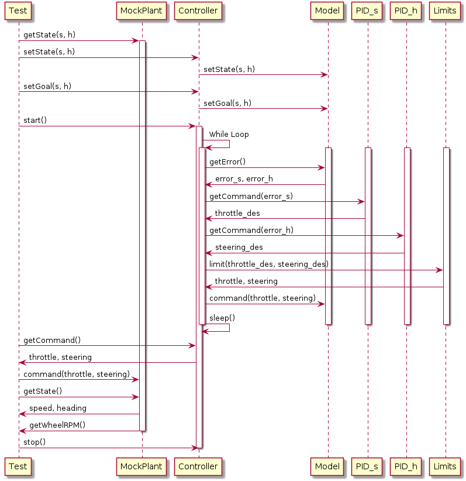

# Ackermann Controller
[](https://travis-ci.org/danielmohansahu/ackermann-controller)
[](https://coveralls.io/github/danielmohansahu/ackermann-controller?branch=master)
[](https://opensource.org/licenses/MIT)
---

## Overview

This is an implementation of an [Ackermann Steering Geometry](https://en.wikipedia.org/wiki/Ackermann_steering_geometry) controller. The user is able to input a desired heading and speed in the global reference frame which the controller will drive the robot model towards, based upon rover parameters and limitations.

To calculate the Ackermann steering angles for a four wheeled vehicles, a simplified model with a single front and rear wheel is assumed. The steering angle of this simulated single steering wheel is used to calculate the updated heading of the rover along with the vehicle wheel base. For an Ackermann steering system, the two actual steering wheels are perpindicular to the radius of the turning circle traced by each wheel; the difference in angles for each of these wheels can be calculated based on the track of the rover. The different turning circles and the vehicle speed are used to calculate individual wheel speeds.
  
## Simulation
### Description of Simulation/Visualization Software
To visualize and simulate the performance of the Ackermann controller, **TODO: INSERT DETAILS ON DEMO**.

### Results and Performance Examples
**TODO: Add results and performance examples when visualization complete. Stub section included below.**
* Example of speed PID controller effectiveness (overshoot, oscillation, limits are enforced).
* Example of heading PID controller effectiveness (overshoot, oscillation, limits are enforced).
* Example of wheel speed outputs during straight driving and continuous speed turns in both directions (outer wheel speeds up, inner wheel slows down).

## Personnel
* Spencer Elyard, *TODO: Complete personnel blurb.*
* Santosh Kesani, *TODO: Complete personnel blurb.*
* Daneil Sahu, *TODO: Complete personnel blurb.*

## Licensing
This project uses the MIT License as described in [the license file](LICENSE).

## Engineering Processes and Documentation

Details on the status of our Agile Iterative Process (AIP) [can be found here](https://docs.google.com/spreadsheets/d/1nx85sowA3IRX-usU_M1hhwHplOLXMWdkvec2w3Roi5Q/edit?usp=sharing).

Sprint planning notes and reviews [can be found here](https://docs.google.com/document/d/1MEoRXtJXdUWnkTbJmcDfJYct3i6_LEJ-TULpP2h_qYA/edit?usp=sharing).

## Operation/Run/Test/Demonstration Steps
**TODO: Generate these steps.**

## Dependencies
**TODO: Get list of dependencies (visualization/simulation tool).**

## Known Bugs and Issues
**TODO: Annote bugs and issues when uncovered.**

## API / Developer Documentation
### Build Instructions
**TODO: Update with instructions on installation of simulation/visualization tools as appropriate.**
```
git clone https://github.com/danielmohansahu/ackermann-controller
cd <path to repository>
mkdir build
cd build
cmake ..
make
Run tests: ./test/cpp-test
Run program: ./app/shell-app
```
### Demonstration Instructions
**TODO: Stub section - complete with more information when simulator/visualizer selected.**

### Testing Instructions
**TODO: Stub section - complete with more information when more testing sections completed.**

### Documentation Generation instructions
**TODO: Stub section - complete with instructions for Doxygen documentation generation.**

### Parameters and Limitations
**TODO: Add default values once established.**
#### Rover Model
The controller enforces the various limitations of the rover:

* Physical Parameters
  * Robot wheel base (length between front and rear wheels)
  * Robot wheel track (width between center of left and right wheels)
  * Robot maximum and minimum motor RPM
  * Maximum allowable steering angle (absolute value)
* Dynamic Limitations
  * Maximum (forward) and minimum (reverse) speed limitations
  * Maximum (forward) and minimum (reverse) acceleration limitations
  * Maximum (right) and minimum (left) angular velocity limitations
  * Maximum (right) and minimum (left) angular acecleration limitations
* Controller Parameters
  * Frequency
  * PID controller parameters for speed control
  * PID controller parameters for heading control
  
#### Controller Model
The controller will accept the following inputs:

* Desired heading (global coordinate frame) and speed
* Update to current speed and heading from rover model

The controller will provide the following outputs:

* Throttle and Steering Commands, limited as appropriate by the established limitations from the rover model
* Current calculated speed and heading
* Current desired heading (global coordinate frame) and speed
* Current drive wheel velocities

## Class Diagram

An overview of the classes used and their dependencies is shown in the following UML diagram:


## Activity Diagram

An example usage activity diagram is shown in the following UML diagram:


